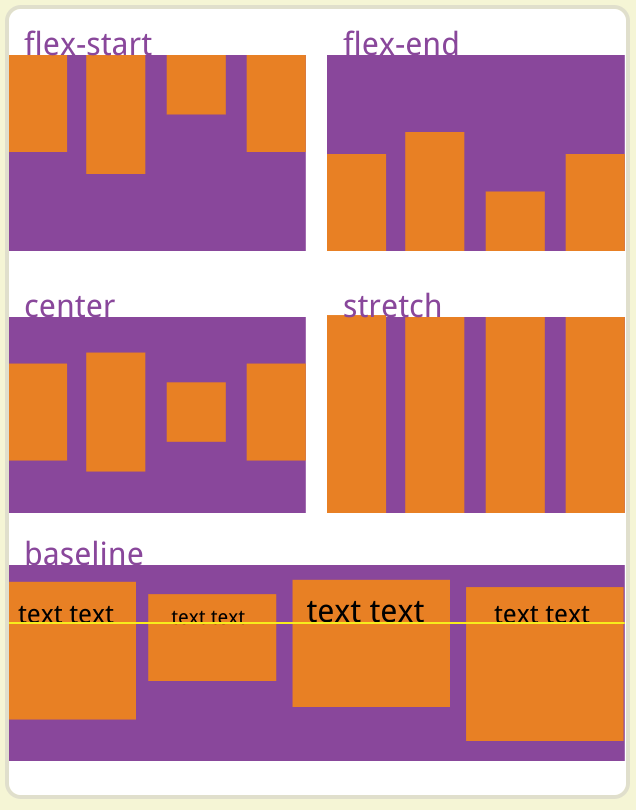
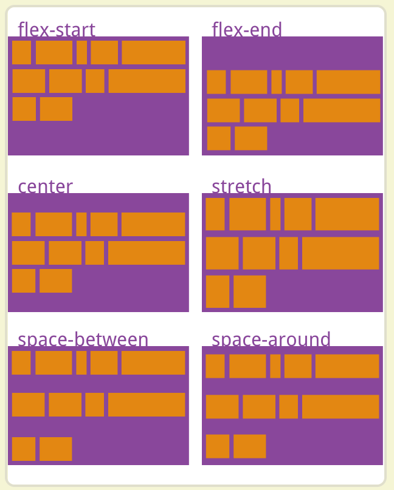
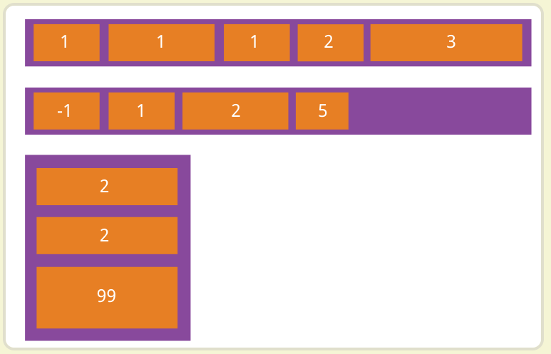

### flex

[阮一峰 flex 教程](https://www.ruanyifeng.com/blog/2015/07/flex-grammar.html)

#### 父级元素 容器

##### flex-direction

决定主轴的方向，即项目的排列方向

```css
.box {
  flex-direction: row | row-reverse | column | column-reverse;
}
```

1. row（默认值）：主轴为水平方向，起点在左端
2. row-reverse：主轴为水平方向，起点在右端
3. column：主轴为垂直方向，起点在上沿
4. column-reverse：主轴为垂直方向，起点在下沿

##### flex-wrap

默认情况下，项目都拍在一条线上（轴线）。flex-wrap 属性定义，如果一条轴线排不下，如何换行。

```css
.box {
  flex-wrap: nowrap | wrap | wrap-reverse;
}
```

1. nowrap（默认）：不换行
2. wrap：换行，第一行在上方
3. wrap-reverse：换行，第一行在下方

##### justify-content

justify-content 定义了项目在主轴上的对齐方式

```css
.box {
  justify-content: flex-start | flex-end | center | space-between | space-around;
}
```

1. flex-start（默认值）：左对齐
2. flex-end：右对齐
3. center：居中
4. space-between：两端对齐，项目之间的间隔相等
5. space-around：每个项目两侧的间隔相等。所以，项目之间的间隔比项目与边框的间隔大一倍

##### align-items

align-items 属性定义项目在交叉轴上如何对齐

```css
.box {
  align-items: flex-start | flex-end | center | baseline | stretch;
}
```



1. flex-start：交叉轴的起点对齐
2. flex-end：交叉轴的终点对齐
3. center：交叉轴的中间对齐
4. baseline：项目的第一行文字的基线对齐
5. stretch（默认值）：如果项目未设置高度或设为 auto，将占满占整个容器的高度

##### align-content

align-content 属性定义了多根轴线的对齐方式。如果项目只有一根轴线，该属性不起作用

```css
.box {
  align-content: flex-start | flex-end | center | space-between | space-around | stretch;
}
```



1. flex-start：与交叉轴的起点对齐
2. flex-end：与交叉轴的终点对齐
3. center：与交叉轴的中间对齐
4. space-between：与交叉轴两端对齐，轴线之间的间隔平均分布
5. space-around：每根轴线两侧的间隔都相等。所以轴线之间的间隔比轴线与边框的间隔大一倍
6. stretch（默认值）：轴线占满整个交叉轴

#### 子元素 项目

##### order

order 属性定义项目的排列顺序。数值越小，排列越靠前，默认为 0

```css
.item {
  order: 1;
}
```



##### flex-grow

flex-grow 的属性定义项目的放大比例，默认为 0，即如果存在剩余空间，也不放大

```css
.item {
  flex-grow: 1;
}
```

如果所有项目的 flex-grow 属性都为 1，则他们将等分剩余空间（如果有的话）。如果一个项目的 flex-grow 属性为 2，其他项目都为 1，则前者占据的剩余空间将比其他项多一倍。  
若存在剩余空间，则根据总和为 1 分配，flex-grow 总和超过 1 按照比例分配。

##### flex-shrink

flex-shrink 属性定义了项目的缩小比例，默认为 1，即空间不足，该项目将缩小。

```css
.item {
  flex-shrink: 1;
}
```

如果所有项目的 flex-shrink 属性都为 1，当空间不足时，都将等比例缩小。如果一个项目的 flex-shrink 属性为 0，其他项目都为 1，则空间不足时，前者不缩小。

负值对该属性无效。

##### flex-basis

flex-basis 属性定义了在分配多余空间之前，项目占据的主轴空间。浏览器根据这个属性，计算主轴是否有多余空间。它的默认值为 auto，即项目的本来大小。

```css
.item {
  flex-basis: auto;
}
```

它可以设为跟 width 或 height 属性一样的值，则项目将占据固定空间。

##### flex 属性

flex 属性是 flex-grow、flex-shrink 和 flex-basis 的简写，默认为 0 1 auto

```css
.item {
  flex: none;
}
```

该属性有两个快捷键：auto（1 1 auto）和 none（0 0 auot）  
建议优先使用这个属性，而不是单独写三个分离的属性，因为浏览器会推算相关值

##### align-self

align-self 属性允许单个项目与其他项目不一样的对齐方式，可覆盖 align-items 属性，默认值为 auto，表示继承父元素的 align-items 属性，如果没有父元素，则等同于 stretch。

```css
.item {
  align-self: auto | flex-start | flex-end | center | baseline | stretch;
}
```
